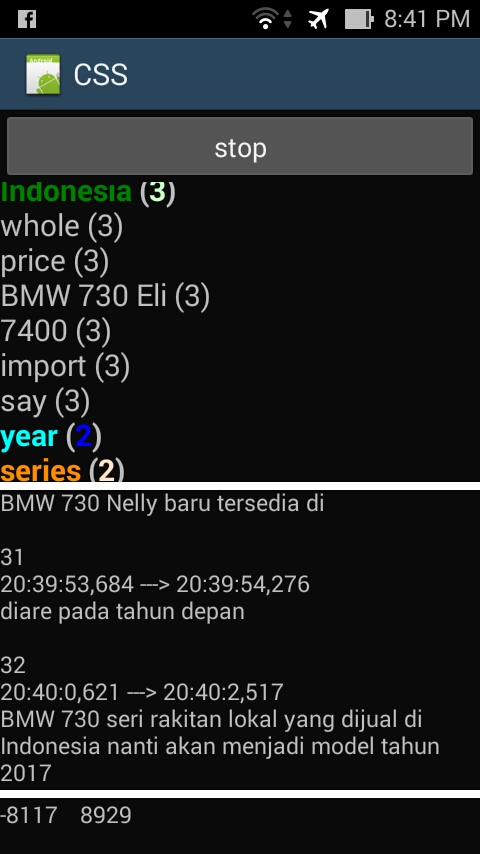
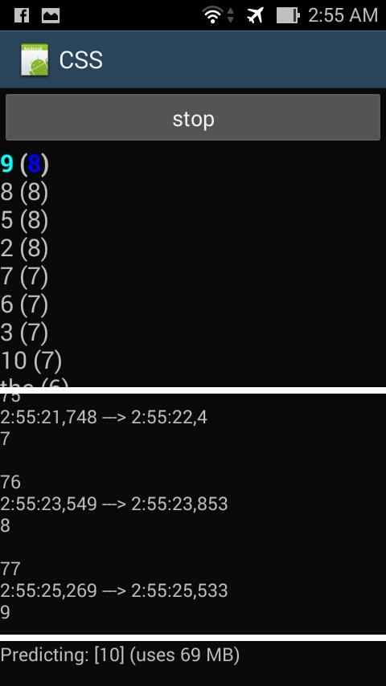
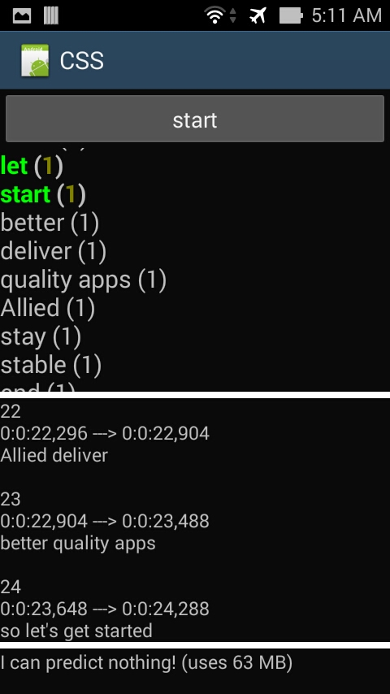
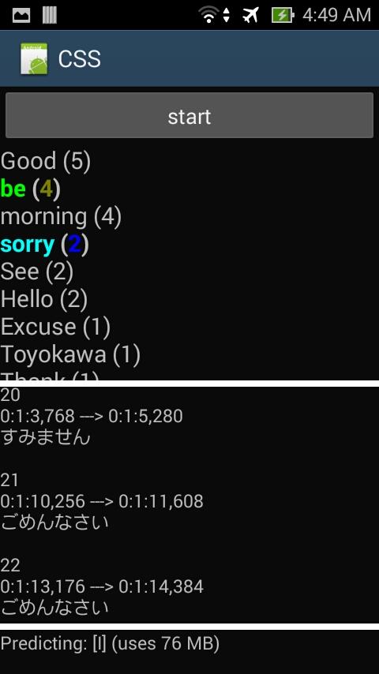

# Continuous Speech Stream

This is the Continuous Speech Stream on Android using Xamarin.

This work was inspired by the work of <a href="https://dl.acm.org/doi/10.1145/2702123.2702532">McMillan and others</a> at Stockholm University's DSV.

© 2016 Indra Bayu

<table>
<tr>
<td width="50%">

&#x25B6; &#x25B6; &#x25B6; &#x25B6; &#x25B6; &#x25B6; &#x25AB; &#x25AB; &#x0031;&#x20E3; &#x25AB; &#x25AB; &#x25C0; &#x25C0; &#x25C0; &#x25C0; &#x25C0; &#x25C0; 

</td>
<td width="50%">

&#x25B6; &#x25B6; &#x25B6; &#x25B6; &#x25B6; &#x25B6; &#x25AB; &#x25AB; &#x0032;&#x20E3; &#x25AB; &#x25AB; &#x25C0; &#x25C0; &#x25C0; &#x25C0; &#x25C0; &#x25C0; 

</td>
</tr>
<tr>
<td width="50%">

&#x25B6; &#x25B6; &#x25B6; &#x25B6; &#x25B6; &#x25B6; &#x25AB; &#x25AB; &#x0033;&#x20E3; &#x25AB; &#x25AB; &#x25C0; &#x25C0; &#x25C0; &#x25C0; &#x25C0; &#x25C0; 

</td>
<td width="50%">

&#x25B6; &#x25B6; &#x25B6; &#x25B6; &#x25B6; &#x25B6; &#x25AB; &#x25AB; &#x0034;&#x20E3; &#x25AB; &#x25AB; &#x25C0; &#x25C0; &#x25C0; &#x25C0; &#x25C0; &#x25C0; 

</td>
</tr>
</table>

<ul>
<li>The 1st screenshot shows me reading paragraphs of an Indonesian <a href='https://oto.detik.com/read/2016/11/30/183024/3359092/1207/bmw-masih-jual-seri-7-impor-tapi-beda-tipe-dengan-rakitan-lokal?o991102638'>news article</a>, while the 2nd one shows me reading numbers from 1 to 10 and back. We'll focus on these two for now. I'll get to the 3rd and 4th ones later in this article. </li>
<li>In all these pictures, there are 3 text views. In the middle one, you can see the sentences I spoke in Indonesian (changing the language to other than English such as this one is possible via one of the settings). The way an entry is laid out here mimics the content of a SRT file (movie subtitle), giving a description of when and how long each turn takes place. This attempt of making full transcription will certainly never be shown to the user in the final product.</li>
<li>Then the utterances are translated into English, with the tokens and their occurence counts displayed in the upper text view. These <i>keywords</i> are visible to the user and to those who subscribe.</li>
<li>The lower text view (the small one) is for debugging purpose only, showing minimum and maximum frequencies detected from the vioce within a certain period of time (most likely from the latest utterance). But it can also be altered to show the <i>next word prediction</i> like the one shown above, with the application-wide 64 bits memory usage next to it inside the parentheses.</li>
</ul>

Some notes about the settings currently being applied to the system:

1. There are filters applied to the system. 
 Dependency-edges with label enlisted below are removed:<ol>
<li>AUX (Auxiliary (non-main) verb)</li>
<li>P (Punctuation mark)</li></ol>
Tokens with tags enlisted below are removed:<ol>
<li>PRON (Pronoun)</li>
<li>CONJ (Conjunct)</li>
<li>ADV (Adverb)</li>
<li>ADP (Adposition (preposition and postposition))</li>
</ol>
2. Each keyword has an <b>age</b> attached to them. And when the age is not updated within a certain timespan (e.g. 1 minute) the keyword will disappear. Certainly you can put custom pre-keyword-removal action, e.g. sending the keyword to the server together with its occurence count. All of this is executed when the next utterance comes in.
3. When a token or part-of-text is in bold, it means that the token happens to be included in the latest utterance. <ol>
<li>When colored blue, it's an entity of type **organization**. &#x1F4D8;</li>
<li>When colored green, it's an entity of type **place**. &#x1F49A;</li>
<li>When colored purple, it's an entity of type **consumer good**. &#x1F49C;</li>
<li>When colored dark-orange, it's an entity of type **person**. &#x1F3AA;</li>
<li>When colored dark-creme, it's an entity of type **event**. &#x1F4E6;</li>
<li>When colored orange, it's an entity of type **work-of-art**. &#x1F4D9;</li>
<li>When colored dark-brown, it's an entity of an **unknown** type. &#x1F426;</li>
<li>When colored light green, it's a **verb** and not an entity. &#x1F34F;</li>
<li>When colored cyan, it's **neither a verb or an entity**. &#x1F535;</li>
</ol>
4. <b>Custom grammar</b>. There's a string array in the "MainActivity.cs" called "inofficialWords" where you can put words/sentences:<ol>
<li>that are supposed to be made-up words or words that don't exist in the chosen official language. You can insert words here that you expect to be spoken by the user; but there's no guarentee of any sort that this will work since the pronunciation of such word/sentence depends heavily on the way it is spoken in the chosen official language.</li>
<li>that are expected to be or often spoken by the user. For example you can put "Please get me" or "Order for me" to raise the success rate of the speech recognition towards such sentences.</li>
</ol>
5. Trivia: if you place a file named "audio.wav" within the "sdcard/Music/" folder, that file will be used as the audio source instead of the microphone. The file has to be in mono channel, 16 KHz sample rate, and 16 bit sample size. As an exercise, you can make audio wave out of this <a href='https://www.lynda.com/Android-SDK-tutorials/Android-SDK-Unit-Testing/478377-2.html'>Lynda.com video</a> &#x1F4F2; or this <a href='https://www.youtube.com/watch?v=MT3ZUP6I7ho'>YouTube video</a> &#x1F530; &#x1F1EF;&#x1F1F5;, and compare the result with the 3rd or 4th picture posted above, respectively. Have fun!  
